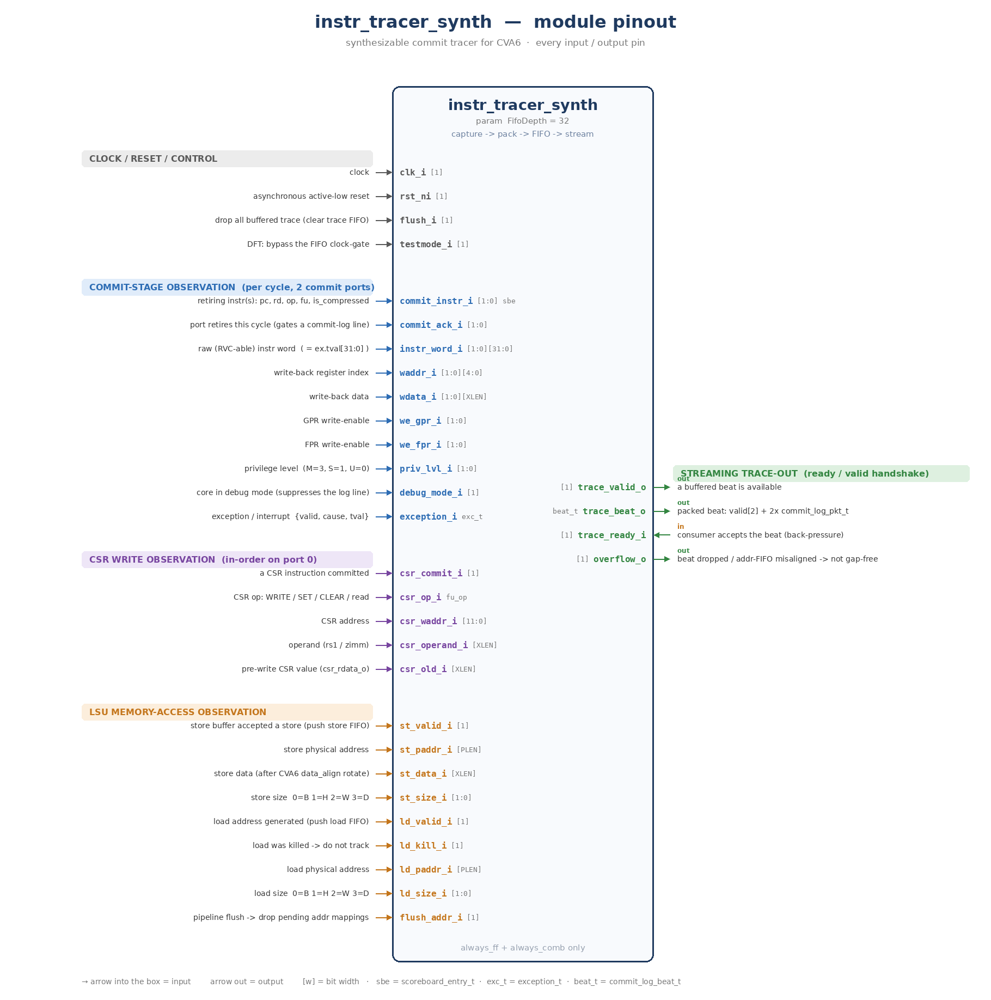
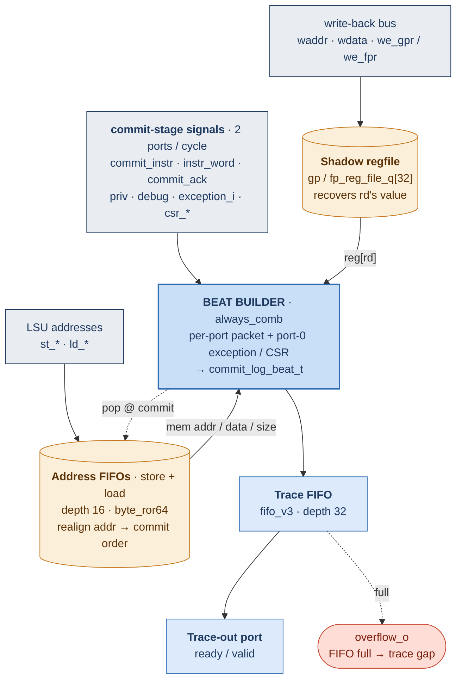
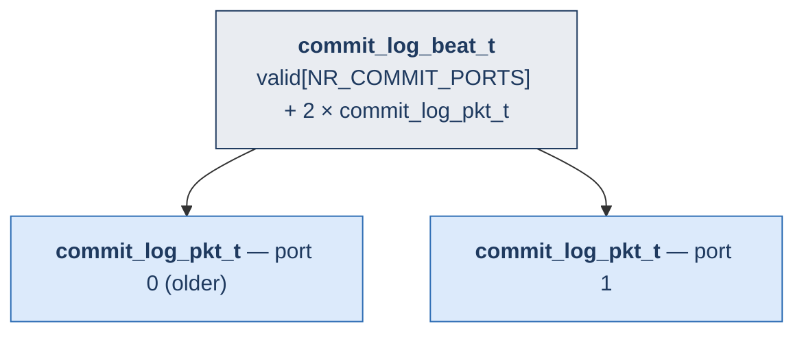

# `instr_tracer_synth` — Internal microarchitecture

A detailed, easy-to-follow view of the synthesizable instruction tracer: how one
cycle of committed instructions becomes a packed trace **beat** that is buffered
and streamed off-chip. Everything below is synthesizable RTL
([instr_tracer_synth.sv](instr_tracer_synth.sv)); the record format lives in
[instr_tracer_synth_pkg.sv](instr_tracer_synth_pkg.sv).

---

## 0. Module pinout (every input / output pin)



Inputs on the left (grouped: clock/reset/control · commit-stage observation · CSR
write observation · LSU memory-access observation); the streaming trace-out
`ready/valid` port on the right. `[w]` is the bit width; `sbe` =
`scoreboard_entry_t`, `exc_t` = `exception_t`, `beat_t` = `commit_log_beat_t`.
Re-render with `python3 scripts/gen_tracer_pinout.py`.

---

## 1. Block diagram — the beat builder and its two memories

The heart is one combinational **beat builder**. It reads the live commit-stage
signals plus two on-chip memory structures — a **shadow regfile** (to recover a
register's value) and **address FIFOs** (to realign out-of-order LSU addresses) —
and emits one packed beat, which a FIFO buffers and a `ready/valid` port streams out.



**What each block does**

| Block | Role | Why it's there |
|-------|------|----------------|
| **Shadow regfile** `gp/fp_reg_file_q[32]` | mirrors the latest value of every register (`always_ff`) | Spike prints `rd`'s value even when it isn't on the write-back bus this cycle |
| **Address FIFOs** + `byte_ror64` | buffer LSU addresses, popped at commit | the LSU generates addresses **out of program order**; the FIFO realigns each to the retiring instruction |
| **Beat builder** (`always_comb`) | pack one record per port + port-0 exception / CSR → `commit_log_beat_t` | one record per retired instruction, in program order |
| **Trace FIFO** (`fifo_v3`, depth 32) | buffer finished beats | absorb back-pressure from the trace-out port |
| **Trace-out port** (`ready`/`valid`) | stream beats off-chip | connect to UART / AXI-DMA / debug port / on-chip buffer |

---

## 2. ASCII block diagram (same thing, no Mermaid needed)

```
 write-back bus      commit-stage signals · 2 ports/cycle        LSU addresses
 waddr·wdata·we_*    commit_instr · instr_word · commit_ack      st_* · ld_*
                     priv · debug · exception_i · csr_*
        │                              │                               │
        ▼                              ▼                               ▼
┌───────────────┐           ┌─────────────────────┐           ┌─────────────────┐
│ Shadow regfile│           │    BEAT BUILDER     │           │ Address FIFOs   │
│ gp/fp_q[32]   │──reg[rd]─►│ (always_comb)       │◄─── mem ──│ store + load    │
│               │           │ per-port packet     │─── pop ──►│ depth 16        │
│ recovers rd's │           │ + port-0            │           │ + byte_ror64    │
│ value when not│           │ exception / CSR     │           │ realign LSU     │
│ on the WB bus │           │                     │           │ addr → commit   │
└───────────────┘           └──────────┬──────────┘           └─────────────────┘
                                       ▼
                          ┌─────────────────────────┐
                          │ Trace FIFO              │ ──full──►  overflow_o
                          │ fifo_v3 · depth 32      │
                          └────────────┬────────────┘
                                       ▼
                          ┌─────────────────────────┐
                          │ Trace-out port          │
                          │ ready / valid           │
                          └─────────────────────────┘
```

---

## 3. What goes into one trace record

A **beat** keeps both commit ports of one cycle together so program order survives
the FIFO (port 0 is the older instruction).



Each `commit_log_pkt_t` (≈300 bits @ XLEN=64, packed MSB-first):

| Group | Fields |
|-------|--------|
| **Identity** | `priv` · `debug` · `retired` · `compressed` · `rd` (+`rd_fpr`) · `pc` · `instr` |
| **Result** | `we` · `wdata` |
| **Exception** | `ex_valid` · `cause` · `tval` |
| **Memory** | `mem_op` · `mem_addr` · `mem_data` · `mem_size` |
| **CSR write** | `csr_we` · `csr_addr` · `csr_wdata` |

These are exactly the fields `riscv::spikeCommitLog()` consumes — the host decoder
(or the sim sink) turns them back into Spike-format ASCII.

---

## 4. The 3 packing rules (how fields are filled)

**Rule 1 — result value (a 3-way mux), per port**

```text
if (we_gpr | we_fpr)   result = wdata_i            // written this cycle
else if (rd is FPR)    result = fp_reg_file_q[rd]   // shadow FP regfile
else                   result = gp_reg_file_q[rd]   // shadow GP regfile
```

**Rule 2 — memory token (`mem 0x..`), only when the instruction commits**

```text
STORE (non-AMO) → MEM_STORE, pop store FIFO, data = byte_ror64(fifo.data)
LOAD            → MEM_LOAD  (up to 2 loads/cycle), addr from load FIFO
otherwise       → MEM_NONE
```
> AMOs report `fu == STORE` but never push the store buffer, so they must **not**
> pop the store FIFO (keeps it aligned).

**Rule 3 — port-0-only overrides (always on the older port 0)**

```text
exception.valid & !(debug & BREAKPOINT) → ex_valid, cause, tval
csr_commit & op ∈ {WRITE, SET, CLEAR}    → csr_we, reconstruct csr_wdata
                                            (SET: op|old, CLEAR: ~op&old, WRITE: op)
```

---

## 5. Back-pressure & overflow

The trace-out port is a standard `ready/valid` handshake. If the consumer stalls
and the trace FIFO fills, the produced beat is dropped and `overflow_o` pulses to
flag that the trace is **no longer gap-free**. The address FIFOs raise it too on
over/underflow (a `mem` token could be misaligned). Raise `FifoDepth` or widen the
output bandwidth to avoid it.

---

*Generated companion to [README.md](README.md) and [TUTORIAL.md](TUTORIAL.md).*
